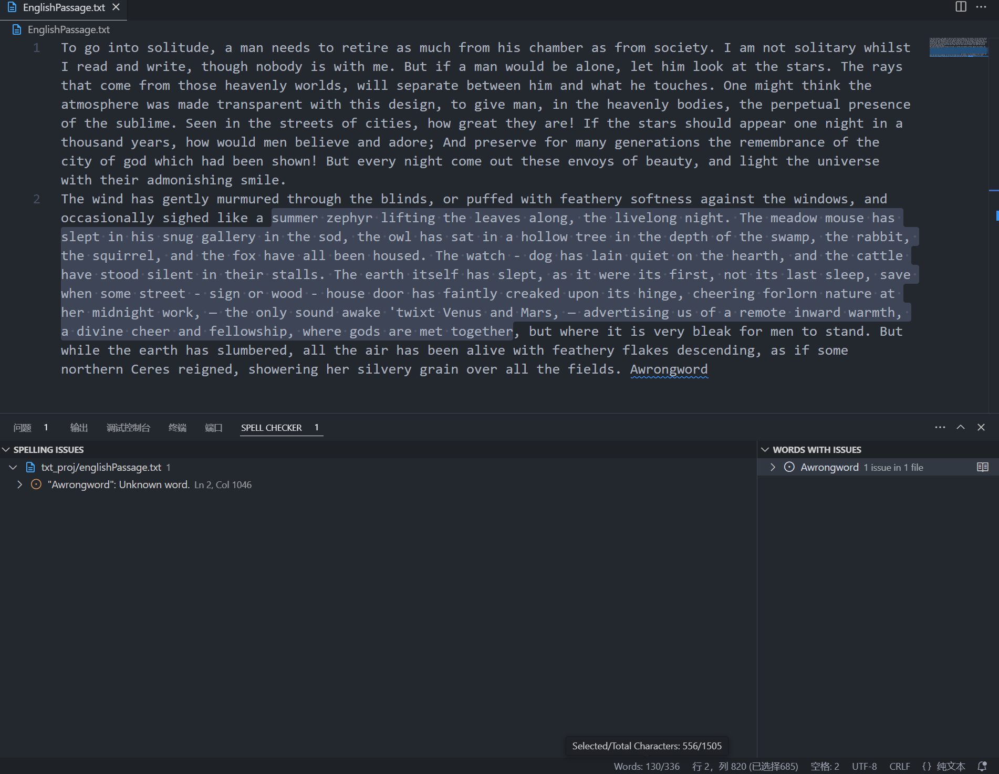

# English Writing Formatter

English | [简体中文](#简体中文)

## Introduction
This is a simple project designed to assist with English writing.

## Features
- Formatting, including automatic formatting on command and save
- Word and character count display in status bar (mouse hover)

## Recommended Extensions
- streetsidesoftware.code-spell-checker: Help catch common spelling errors.

## Effect

---

# 英语写作格式化工具

[English](#english-writing-formatter) | 简体中文

## 简介
这是一个简单的用于辅助英语写作的项目。

## 功能
- 格式化，包括命令和保存时自动格式化
- 状态栏显示字数以及字符数(鼠标悬停)

## 推荐插件
- streetsidesoftware.code-spell-checker：可以提示单词错误。

## 效果
